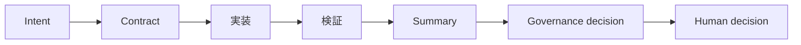
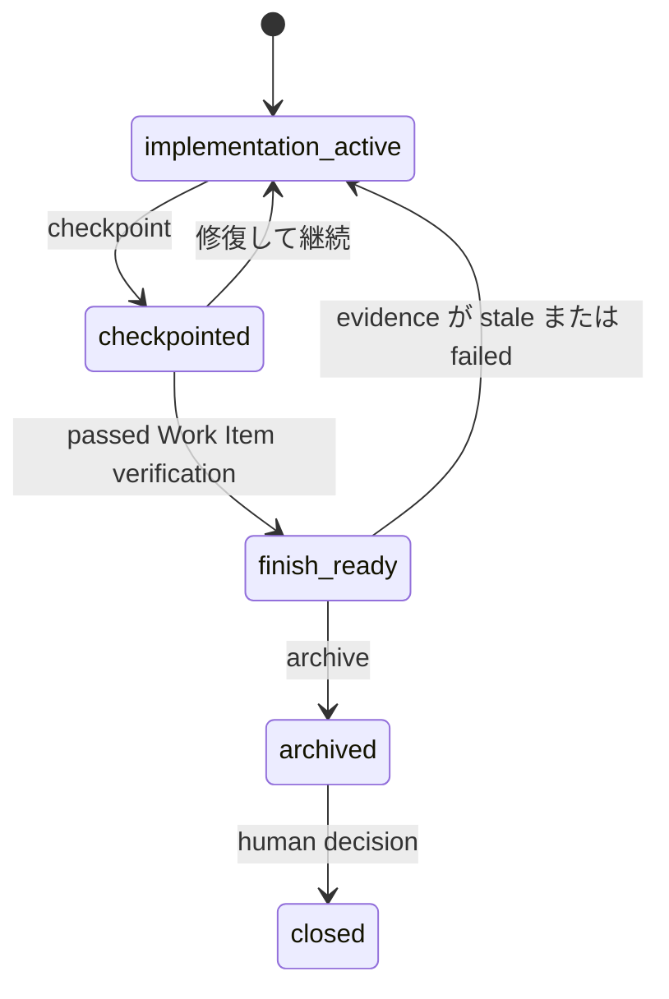

# Architecture

## 目的

このページは、**人間の request が review 可能な repository decision になるまでと、インストール
された runtime がどこに位置するか**を説明します。

## 対象読者

directory tour ではなく project map が必要な adopter、maintainer、reviewer 向けです。fact や
responsibility をどこに置くべきか判断するときに読んでください。

## 読後の理解

runtime path、evidence の ownership、installation と repository attach の分離、そして AI Cockpit
の外部に残る control を理解できます。

## Governed runtime path

reader-facing な decision lifecycle は次の通りです。



Work Item の state transition も明示されています。



```text
Human / Agent / CI
        │ intent、scope、contract
        ▼
      CLI / MCP adapter
        │ normalized request
        ▼
      cockpit-core (pure decision)
        │ shared application service
 ┌──────┼──────────┬───────────┬───────────┐
 ▼      ▼          ▼           ▼           ▼
Git  Repository  Evidence  Verification  Knowledge
        │          │           │           │
        └──────────┴───────────┴───────────┘
                         │
                         ▼
             decision + evidence + human checkpoint
                         │
                         ▼
                 対象 repository の `.ai/`（`cockpit.toml` を含む）
```

1. **CLI / MCP adapter** は user/tool request を同じ application service の input に変換します。
2. **`cockpit-core`** は typed fact を deterministic に評価します。filesystem を走査したり Git
   を直接呼び出したりしません。
3. **Git** は明示的な repository snapshot を作り、**Repository** は attach、Work Item lifecycle、
   status、local write を所有します。
4. **Evidence** は content-addressed receipt と fail-closed reuse を検証し、**Verification** は
   bounded command を計画・実行し、**Knowledge** は完了した fact を後から検索できる形に投影します。
5. 結果は evidence と human checkpoint を持つ decision です。binary の install は `.ai` を作らず、
   `attach` は別の明示的な操作です。

## Evidence ownership

```text
AI Cockpit repository governance | external runtime、identity、provider、enterprise control
```

左側は request、scope、repository snapshot、verification record、Work Item status、local evidence
link を所有します。右側は Agent identity、branch protection、process sandbox、SBOM、signature、
provenance、vulnerability scan、production isolation、provider attestation を所有します。AI Cockpit
は delegated evidence を bind して表示できますが、繰り返し記述するだけで外部 proof を真にすることはできません。

## Runtime と installation は別です

```text
Release archive / Homebrew / Cargo Git
                  │ one binary を install
                  ▼
            `ai-cockpit`
                  │ 明示的な `attach --repo <path>`
                  ▼
       対象 repository + `.ai/cockpit.toml` + `.ai/project.json`
```

`cockpit.toml` は repository configuration format のままで `.ai/` 配下に置かれます。installed runtime を対象 repository
へ copy せず、この development checkout も意図的に `.ai` を持ちません。

release と Homebrew の trust path は
[Release distribution architecture](architecture/release-distribution.ja.md) を参照してください。

## Scenario

誰かが Agent に「docs を整理して」と依頼したとします。edit 前に request は scope と acceptance
condition を持つ Work Item になります。Agent はその boundary だけを変更し、check が evidence を
作り、summary と status が結果を review 可能にし、人間が次の action の安全性を判断します。

## Stop conditions

boundary のない request、曖昧な evidence ownership、protected execution 中の snapshot 変更、または
local record を external control の proof として使う場合は停止します。missing link は investigate
する理由であり、推測する理由ではありません。

## 次に読むもの

1. [設計思想](philosophy.ja.md) — boundary の原則。
2. [機能一覧](capabilities.ja.md) — 一般ユーザーができること。
3. [製品境界](architecture/product-boundary.ja.md) — scope 外の責任。
4. [Repository Protocol v1](protocol/v1/specification.ja.md) — machine-facing contract。

## 技術的な深さ

Rust workspace は protocol type、pure governance core、Git access、repository service、evidence、
verification、knowledge、adapter を別 crate に分けます。CLI と MCP は同じ repository service を共有します。
Repository Protocol version は runtime version と独立し、runtime code を adopter repository に install しません。
