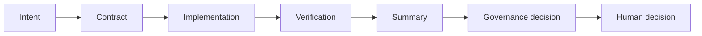
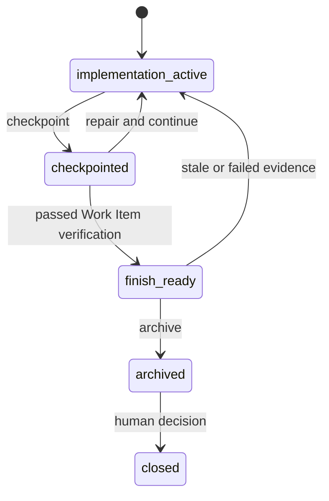
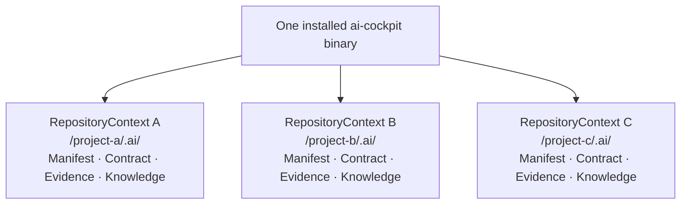

# Architecture

## Purpose

This page answers: **how does a human request become a reviewable repository
decision, and where does the installed runtime fit?**

## Audience

Read it when you need the project map rather than a directory tour: adopters,
maintainers, and reviewers deciding where a fact or responsibility belongs.

## Outcome

You will understand the runtime path, the ownership of evidence, the separation
between installation and repository attachment, and the controls that remain
outside AI Cockpit.

## The governed runtime path

The reader-facing decision lifecycle is:



The Work Item state path is explicit:



```text
Human / Agent / CI
        │ intent, scope, contract
        ▼
   CLI / MCP adapters
        │ normalized request
        ▼
   cockpit-core (pure decision)
        │ shared application services
 ┌──────┼──────────┬───────────┬───────────┐
 ▼      ▼          ▼           ▼           ▼
Git  Repository  Evidence  Verification  Knowledge
        │          │           │           │
        └──────────┴───────────┴───────────┘
                         │
                         ▼
       decision + evidence + human checkpoint
                         │
                         ▼
             target repository `.ai/` (including `cockpit.toml`)
```

1. **CLI / MCP adapters** accept a user or tool request and translate it into
   the same application service input.
2. **`cockpit-core`** evaluates typed facts deterministically. It does not walk
   a filesystem or call Git directly.
3. **Git** creates an explicit repository snapshot; **Repository** owns attach,
   Work Item lifecycle, status, and local writes.
4. **Evidence** validates content-addressed receipts and fail-closed reuse;
   **Verification** plans and executes bounded commands; **Knowledge** projects
   completed facts for later lookup.
5. The result is a decision with evidence and a human checkpoint. Installing the
   binary does not create `.ai`; `attach` is a separate, explicit operation.

## Evidence ownership

```text
AI Cockpit repository governance | external runtime, identity, provider, and enterprise controls
```

The left side owns request, scope, repository snapshot, verification records,
Work Item status, and local evidence links. The right side owns agent identity,
branch protection, process sandboxing, SBOM generation, signatures, provenance,
vulnerability scanning, production isolation, and provider attestations. AI
Cockpit can bind and display delegated evidence; it cannot make external proof
true by repeating it.

## Runtime and installation are separate

```text
Release archive / Homebrew / Cargo Git
                  │ installs one binary
                  ▼
            `ai-cockpit`
                  │ explicit `attach --repo <path>`
                  ▼
        target repository + `.ai/` scaffold + discovery manifest
```

`cockpit.toml` remains the repository configuration format and is stored under
`.ai/`. The installed
runtime is not copied into the target repository, and this development checkout
intentionally remains without `.ai`.

The full release and Homebrew trust path is documented in
[Release distribution architecture](architecture/release-distribution.md).

## Shared Runtime, isolated Repository Contexts

AI Cockpit is installed once per machine. Each request must bind an explicit
repository; the Core never keeps a global active repository, Work Item, or
project profile.



The CLI therefore requires `--repo` on repository-bound commands, for example
`ai-cockpit status --repo /project-a` and `ai-cockpit verify --repo /project-b`.
The MCP process is launched with the same explicit repository binding; its
repository-local manifest can advertise the stable `repositoryId` to a client.
Runtime upgrades are shared; Contracts, receipts,
knowledge, and repository state are not. Work Item evidence records the
`runtimeVersion`, `runtimeDigest`, and `protocolVersion` that produced it.

### Scaffolding is not a governance decision

`attach` creates only the minimum `.ai/` tree and a repository-local
`agent-interface.json` discovery manifest. `work-item new` creates a
`not_ready` Contract from snapshot-derived facts and prints the human fields
that still require intent and authority. It never installs provider rules or
claims approval, verification, or completion. `profile propose` is a read-only
`candidate`/`proposed` amendment; changing the formal profile remains an
explicit human apply step.

## Scenario

Someone asks an agent to “clean up the docs.” Before any edit, the request
becomes a Work Item with scope and acceptance conditions. The agent changes only
that boundary; checks produce evidence; the summary and status make the result
reviewable; a human decides whether the next action is safe.

## Stop conditions

Stop when a request has no declared boundary, when evidence ownership is
ambiguous, when a protected snapshot changes during execution, or when a local
record is used as proof of an external control. Missing links are reasons to
investigate, not reasons to guess.

## Next steps

1. [Design Philosophy](philosophy.md) — the principles behind the boundary.
2. [Capabilities](capabilities.md) — what a general user can do.
3. [Product boundary](architecture/product-boundary.md) — explicit exclusions.
4. [Repository Protocol v1](protocol/v1/specification.md) — machine-facing contract.

## Technical depth

The Rust workspace keeps protocol types, the pure governance core, Git access,
repository services, evidence, verification, knowledge, and adapters in separate
crates. CLI and MCP share the same repository services. Repository Protocol
versioning is independent from runtime versioning, and runtime code is never
installed into an adopter repository.
