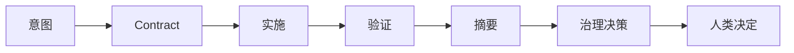
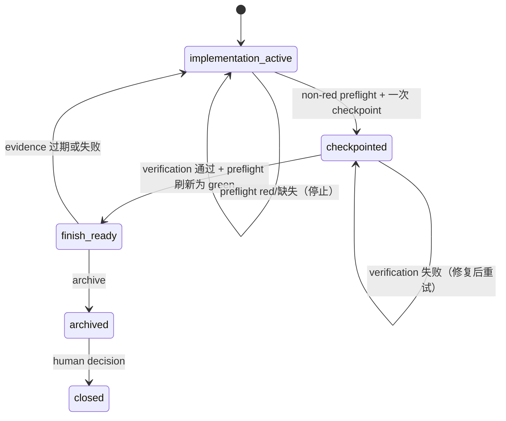
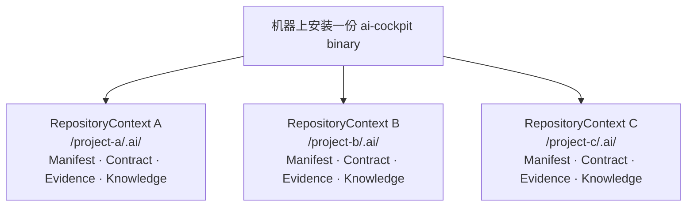

# 架构

## 结构化操作请求

Adapter 可以向 Core 提交 `RequestedOperationV2` envelope。它把请求绑定到
repository ID 和 Work Item ID，并携带明确的 operation、scope、authority、
evidence 和 policy reference。`CapabilityMappingV2` 必须声明相同的 operation
及其确定性的 action class；capability 不能扩大 scope，也不能把 destructive
operation 重新标记为普通写入。

Core 先验证 schema 和 identity，再将 envelope 映射到现有的纯治理 evaluator。
它不会从可选的 `intent` 字段或 Agent 文本推导 authority、scope 或 operation。
未来的 request-envelope schema 会在 adapter 显式支持前被拒绝；它与 repository
schema migration 相互独立。

## 目的

本页回答：**人类请求如何成为可审查的 repository 决策，安装后的 runtime 又位于哪里？**

## 读者

当你需要的是项目地图而不是目录导览时阅读本页：适合采用者、维护者，以及需要判断事实或
责任归属的审查者。

## 读完之后

你会了解 runtime 路径、证据的所有权、安装与 repository attach 的分离，以及仍然属于
AI Cockpit 之外的控制。

## 受治理的 runtime 路径

面向读者的决策生命周期是：



Work Item 状态转换也是显式的：



```text
Human / Agent / CI
        │ 意图、范围、contract
        ▼
      CLI / MCP adapter
        │ 规范化请求
        ▼
      cockpit-core（纯决策）
        │ 共享 application service
 ┌──────┼──────────┬───────────┬───────────┐
 ▼      ▼          ▼           ▼           ▼
Git  Repository  Evidence  Verification  Knowledge
        │          │           │           │
        └──────────┴───────────┴───────────┘
                         │
                         ▼
             决策 + 证据 + 人类检查点
                         │
                         ▼
              目标 repository 的 `.ai/`（包含 `cockpit.toml`）
```

1. **CLI / MCP adapter** 接收用户或工具请求，并转换为同一 application service 的输入。
2. **`cockpit-core`** 确定性地评估有类型的事实；它不会遍历 filesystem，也不会直接调用 Git。
3. **Git** 创建显式 repository snapshot；**Repository** 负责 attach、Work Item 生命周期、
   status 和本地写入。
4. **Evidence** 验证内容寻址 receipt 并执行 fail-closed reuse；**Verification** 规划和执行
   有界命令；**Knowledge** 把已完成的事实投影为后续可查询的内容。
5. 结果是带有证据和人类检查点的决策。安装 binary 不会创建 `.ai`；`attach` 是独立且显式的操作。

## 证据所有权

```text
AI Cockpit repository governance | 外部 runtime、identity、provider 和 enterprise control
```

左侧负责 request、scope、repository snapshot、verification record、Work Item status 和本地
evidence link。右侧负责 Agent identity、branch protection、process sandbox、SBOM、signature、
provenance、漏洞扫描、生产隔离和 provider attestation。AI Cockpit 可以绑定并展示委托证据，
但不能通过重复描述来让外部证明变成真实。

## Runtime 与安装是分离的

```text
Release archive / Homebrew / Cargo Git
                  │ 安装一个 binary
                  ▼
            `ai-cockpit`
                  │ 显式 `attach --repo <path>`
                  ▼
       目标 repository + `.ai/` scaffold + discovery manifest
```

`cockpit.toml` 仍然是 repository 配置格式，并存放在 `.ai/` 下。安装后的 runtime 不会被复制进目标 repository。

完整的 release 与 Homebrew 信任路径见
[发布分发架构](architecture/release-distribution.zh-CN.md)。

## 共享 Runtime，隔离 Repository Context

AI Cockpit 在一台机器上只安装一份。每次请求都必须显式绑定目标
repository；Core 不保存全局 active repository、Work Item 或 project profile。



因此，CLI 的 repository-bound command 必须带 `--repo`，例如
`ai-cockpit status --repo /project-a` 和 `ai-cockpit verify --repo /project-b`。
MCP 进程也必须用同一显式 repository 绑定启动；repository-local manifest 可以向 client
公布稳定的 `repositoryId`。Runtime
升级可以一次惠及多个项目；Contract、receipt、knowledge 和 repository state
绝不共享。Work Item evidence 记录产生它的 `runtimeVersion`、`runtimeDigest` 和
`protocolVersion`。

### 脚手架不是治理决定

`attach` 只创建最小 `.ai/` 树和 repository-local 的 `agent-interface.json` discovery manifest。
`work-item new` 根据 snapshot 事实创建 `not_ready` Contract，并列出仍需人类提供的 intent 与 authority。
它不会安装 provider rules，也不会声称 approved、verified 或 completed。`profile propose` 是只读的
`candidate`/`proposed` amendment；修改正式 profile 仍必须经过显式的人类 apply 步骤。

## 场景

有人让 Agent“清理文档”。在任何编辑前，请求先成为带有范围和验收条件的 Work Item。Agent
只能修改该边界；检查产生证据；summary 和 status 让结果可审查；最后由人决定下一步是否安全。

## 停止条件

请求没有声明边界、证据所有权不明确、受保护执行期间 snapshot 发生变化，或有人把本地记录当作
外部控制证明时，必须停止。缺少连接是调查原因，不是猜测理由。

## 下一步

1. [设计思想](philosophy.zh-CN.md) — 边界背后的原则。
2. [功能一览](capabilities.zh-CN.md) — 一般用户可以做什么。
3. [产品边界](architecture/product-boundary.zh-CN.md) — 明确不属于范围的内容。
4. [Repository Protocol v1](protocol/v1/specification.zh-CN.md) — 面向机器的 contract。

## 技术深度

Rust workspace 将 protocol type、纯 governance core、Git access、repository service、evidence、
verification、knowledge 和 adapter 分成独立 crate。CLI 与 MCP 共享相同的 repository service。
Repository Protocol version 独立于 runtime version；runtime code 永远不会被安装进 adopter repository。

### Agent handoff 与隔离证据

repository-bound MCP adapter 除了原始 `work_item_get` 查询，还提供 `work_item_outcome`。它调用与 CLI
相同的已校验 OutcomeV2 和 human renderer，因此文本 content 会显示状态标记、unknown、证据、结构化人工
决定投影和下一步。`language` 只本地化 Runtime 生成的 presentation；Contract 原文和机器 JSON 保持不变。
发布验收还会为每个隔离 root 记录文件、目录、symlink 的 metadata 与 digest：HOME 和 XDG_CONFIG_HOME
是禁止写入的 root，TMPDIR 和 CARGO_HOME 是明确分类的 Runtime 写入 root。
