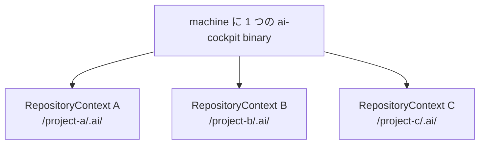

# Runtime topology

```text
Human / Agent / CI
        │
    CLI / MCP adapter
        │
        ▼
    cockpit-core
        │
 ┌──────┼────────┬─────────┐
 ▼      ▼        ▼         ▼
Git  Repository Evidence Verification Knowledge
        │
        ▼
 対象 repository の .ai/
```

`cockpit-core` は pure かつ deterministic です。Adapter は外部 request を core
input に変換し、decision を CLI/MCP response に変換します。Repository access は
明示的な port から提供し、core は filesystem traversal や Git 呼び出しを行いません。

対象 repository に保存するのは facts、decisions、evidence、generated knowledge
projection だけです。Rust source、Python runtime、helper script、runtime schema
copy は保存しません。

## 1 つの Runtime、複数の Repository Context



Core は request-scoped です。`--repo`（または同等の MCP repository binding）で 1 回の
operation の context を選び、global な current repository、Work Item、profile は持ちません。
互換性のある repository は Runtime upgrade を共有できますが、各 context の Contract、
evidence、knowledge は分離されます。
