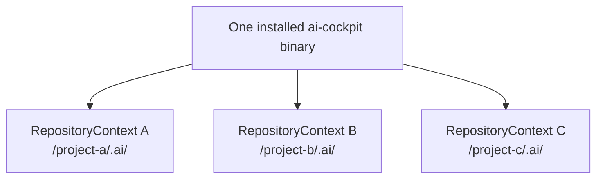
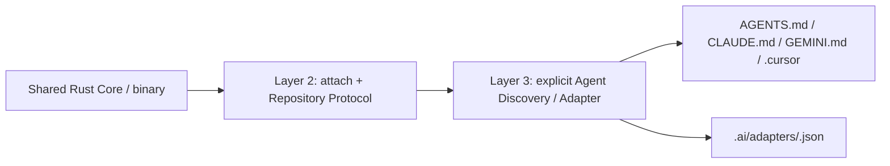

# Runtime Topology

```text
Human / Agent / CI
        │
   CLI / MCP adapters
        │
        ▼
   cockpit-core
        │
 ┌──────┼────────┬─────────┐
 ▼      ▼        ▼         ▼
Git  Repository Evidence Verification Knowledge
        │
        ▼
 Target repository .ai/
```

`cockpit-core` is pure and deterministic. Adapters translate external requests
into core inputs and translate decisions into CLI/MCP responses. Repository
access is supplied through explicit ports; core never traverses a filesystem or
invokes Git.

The target repository stores facts, decisions, evidence, and generated knowledge
projections. It does not store Rust source, Python runtime, helper scripts, or
runtime schema copies.

## One Runtime, many Repository Contexts



The Core is request-scoped. `--repo` (or the equivalent MCP repository
binding) selects one context for one operation; no global current repository,
Work Item, or profile exists. Runtime upgrades are shared across compatible
repositories, while each context owns its Contracts, evidence, and knowledge.

## Agent Discovery / Adapter layer



The discovery manifest (`.ai/agent-interface.json`) contains repository-bound
facts, not prompts or governance decisions. `attach` never injects provider
rules. Only `agent install --repo ... --provider ...` may add an owned managed
section; `doctor`, `repair`, and `detach` verify that ownership before acting.
Provider skills can explain usage, but they are an optional usability layer and
never become Runtime authority.
