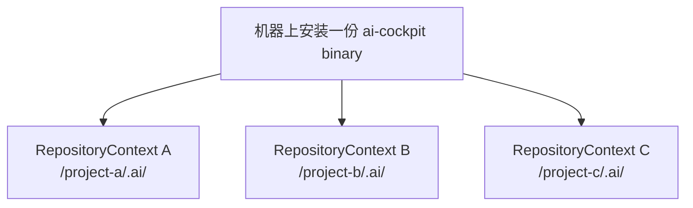

# Runtime 拓扑

```text
Human / Agent / CI
        │
    CLI / MCP adapter
        │
        ▼
    cockpit-core
        │
 ┌──────┼────────┬─────────┐
 ▼      ▼        ▼         ▼
Git  Repository Evidence Verification Knowledge
        │
        ▼
  对象 repository 的 .ai/
```

`cockpit-core` 是纯且确定性的。Adapter 把外部请求转换为 core input，再把决定
转换为 CLI/MCP response。Repository 访问通过显式 port 提供；core 不能遍历
filesystem，也不能调用 Git。

对象 repository 只保存 facts、decisions、evidence 和生成的 knowledge projection，
不保存 Rust source、Python runtime、helper scripts 或 runtime schema copies。

## 一份 Runtime，多个 Repository Context



Core 按请求工作。`--repo`（或等价的 MCP repository binding）为一次操作选择一个
context；不存在全局 current repository、Work Item 或 profile。兼容的 repository
可以共享 Runtime 升级，但每个 context 独立拥有自己的 Contract、evidence 和
knowledge。
